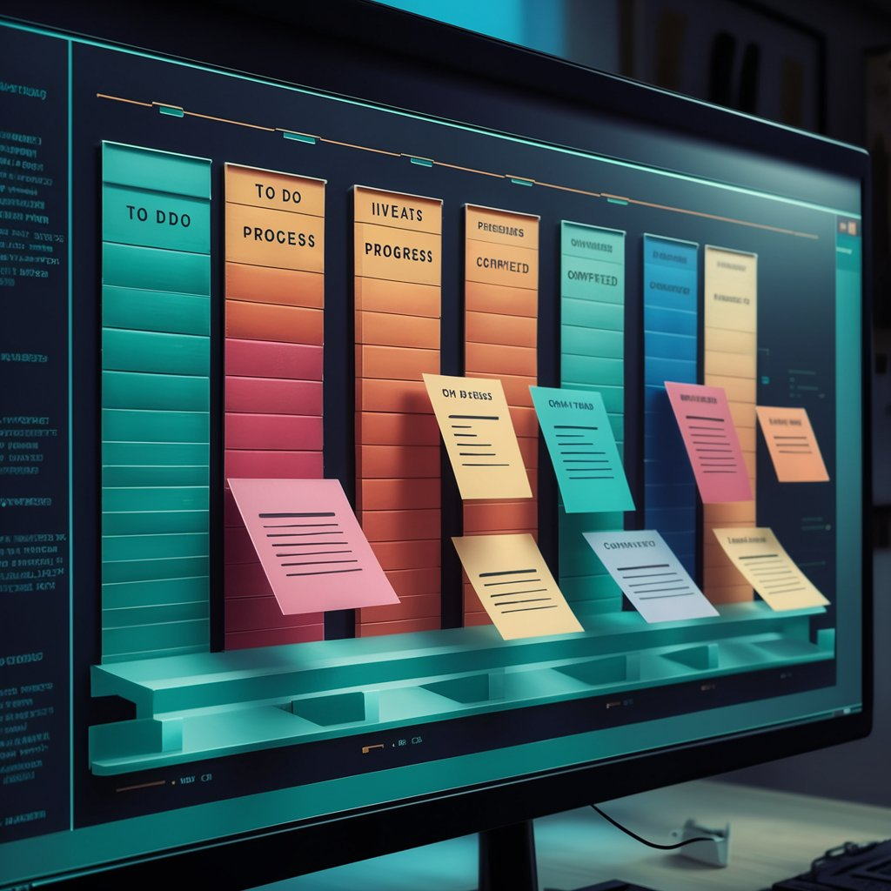

# Kanban-Board


Kanban board is a visual tool for managing and optimizing workflow, typically composed of
columns representing different stages of a process, with tasks moving from left to right as they
progress.



## Local setup

- Clone the repo.

```bash
   git clone https://github.com/<yourusername>/Kanban-Board.git
```

- Install dependencies

```bash
  npm install 
```

- Start the server.
```bash
  npm run start
```

## Demo
[](https://youtu.be/64fcbIze0rs?si=rF87hNt0DVjHNxOP)


## Authors

- [@Praashh](https://www.github.com/Praashh)